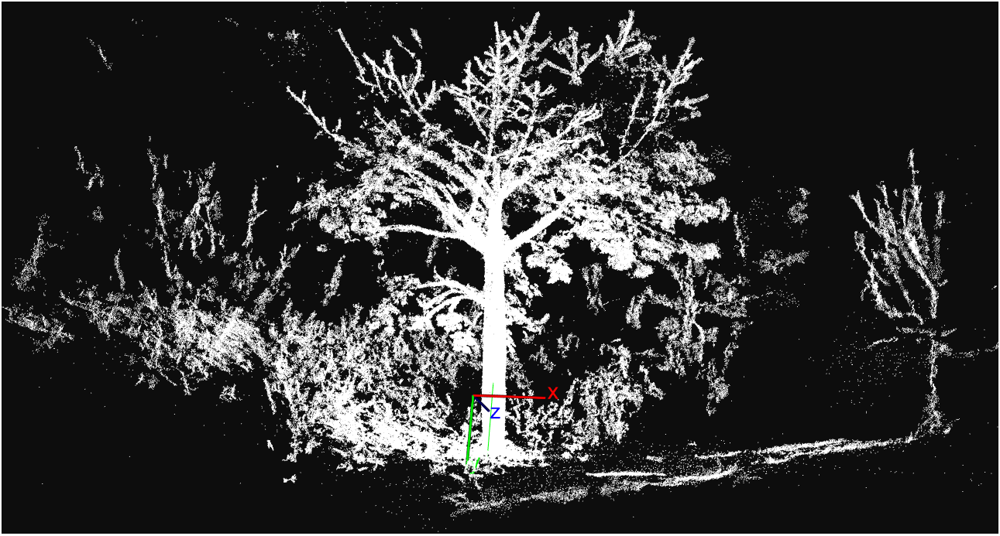

# pcl_visualizer
Visualizer for a 3D point cloud using PCL Library 1.8.1 

----------------------

This program display a PCL viewer for input data with the next extension:

* PCD 
* PLY 
* TXT 
* XYZ 

## Example

 

## Compilation
* Set "YOUR OWN" PCL Build DIR in CMakeList.txt e.g: **/opt/pcl-1.8.1/build** and save it.
* Create a "build" folder

in the main folder:

	- cd /build  
	- cmake ../src/
  	- make
       
        	 
### Test

	cd /build/bin
	./pcl-visualizer <pcd file> 
  	./pcl-visualizer <ply file> 
  	./pcl-visualizer <txt file> 
  	./pcl-visualizer <xyz file> 
  

